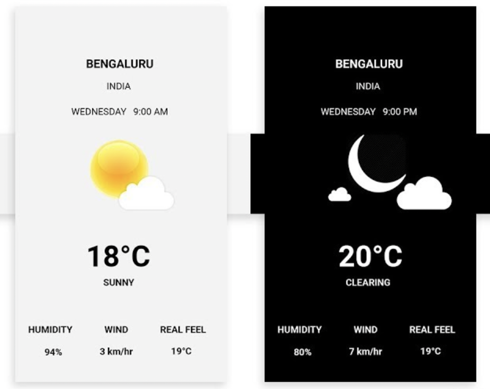

# frontend coding challenge
NovaID just wants to provide the user the weather forcast ability. User who installs NovaID app can see the weather from their current location.


# What do we expect from you 

Build the React Native application that display the information from the current location. The application should access the current location then use this api from open weather api
```
https://api.openweathermap.org/data/2.5/weather?lat={lat}&lon={lon}&appid={API key}
```
We provide the following api key
```
key: fdbb721423d9f05b52a3379ec5e7e5db
name: nova id-weather
```

You can read the api document [see this link](https://openweathermap.org/current)

For the UI/UX, you can refer to this example



As the senior candidate, use your own ability to design a scalable application that allows to develop this application to become the super application. No coding require, you can design the application as you want and share with us the document design in pdf format

Push the code to the github and share the link with us.

# How do we evaluate the test ?
The application must fetch and display the weather information. At least you should display it with text only

It could be nice if the weather can update realtime when you move to another location

As senior candidate, you must finish the scalable application design challenge